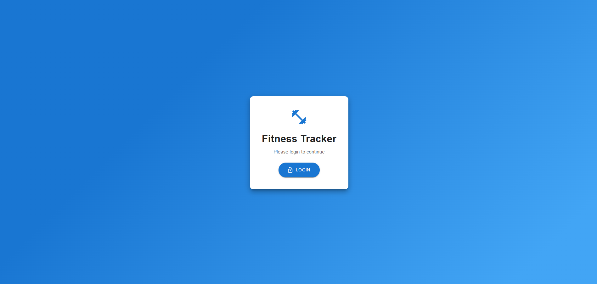
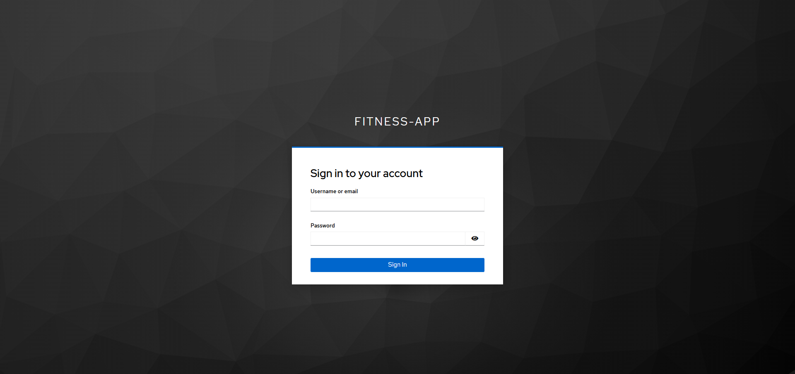
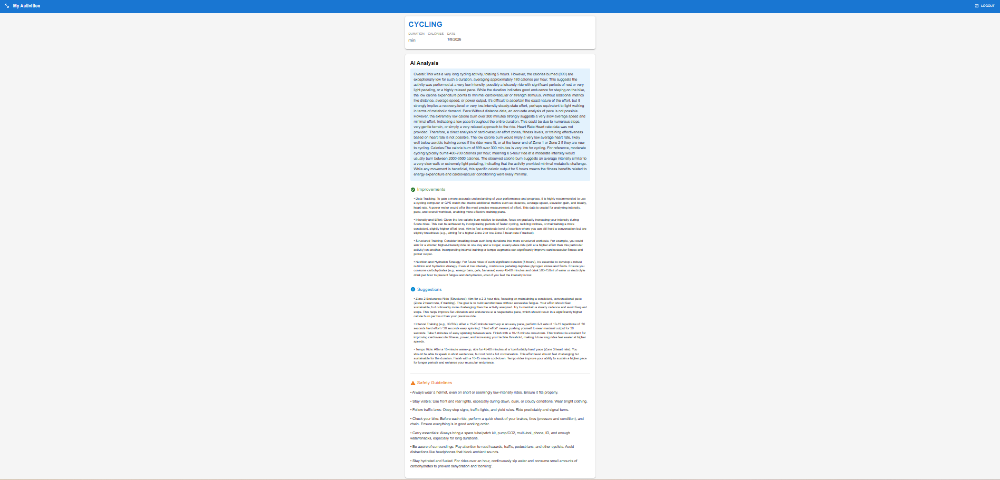

# 🏋️‍♂️ Fitness AI
## AI-Powered Fitness Tracking & Recommendation Platform

Fitness AI is a full-stack, microservices-based fitness application that tracks user activities and generates AI-driven personalized fitness recommendations.
The system is built using Spring Boot microservices, Apache Kafka, Keycloak authentication, and a React (Vite) frontend, following modern cloud-native architecture practices.

### 🚀 Key Features

🔐 Secure authentication using Keycloak (OAuth2 / JWT)

🧩 Microservices architecture with independent services

🔄 Event-driven communication using Apache Kafka

🧠 AI-powered recommendations using Google Gemini API

🌐 Centralized API Gateway for routing and security

📡 Service discovery using Eureka

🗄️ Polyglot persistence with PostgreSQL & MongoDB

🎨 Modern React (Vite) frontend with Material UI

## 📸 Project Screenshots

### 🔐 Login Page

### 🔐 Keycloak Authentication

### 🏃 Add Activity

### 🧠 AI Recommendation View

## 🧠 How the Project Works (High-Level Flow)

### 👤 User logs in via Keycloak OAuth2 PKCE flow from the React frontend

### 🌐 All frontend requests go through the API Gateway

### 🔍 Gateway validates JWT tokens and routes requests to microservices

### 👥 User Service

Stores user profile data in PostgreSQL

Syncs users automatically from Keycloak

### 🏃 Activity Service

Stores fitness activities in MongoDB

Validates users synchronously via User Service

Publishes activity events to Kafka

### 🧠 AI Service

Consumes activity events from Kafka

Calls Google Gemini API

Generates fitness analysis & recommendations

Stores results in MongoDB

### 📊 Frontend fetches activities and AI recommendations for display

## 🏗️ Project Architecture

React (Vite)
     |
     v
API Gateway (Spring Cloud Gateway)
     |
------------------------------------------------
|            |              |                 |
User Service  Activity Service   AI Service    Eureka
(PostgreSQL)  (MongoDB + Kafka)  (MongoDB + AI)

## 📂 Project Structure

Fitness AI/
│
├── userservice/           # User management (PostgreSQL)
├── activityservice/       # Activity tracking (MongoDB + Kafka Producer)
├── aiservice/             # AI recommendations (Kafka Consumer + Gemini API)
├── gateway/               # API Gateway + Security
├── eureka/                # Service Discovery
├── configserver/          # Centralized configuration
├── fitness-frontend/      # React (Vite) frontend
├── Images/                # Screenshots / diagrams
└── README.md

## 🛠️ Tech Stack Used
### 🔹 Backend

Java 21

Spring Boot 3

Spring Cloud

API Gateway

Eureka Discovery

Config Server

Spring Data JPA

Spring Data MongoDB

Spring WebFlux & WebClient

Apache Kafka

Spring Security (OAuth2 Resource Server)

### 🔹 Databases

PostgreSQL – User data

MongoDB – Activities & AI recommendations

### 🔹 AI Integration

Google Gemini API

Prompt-based AI analysis

Structured JSON response processing

### 🔹 Frontend

React (Vite)

Redux Toolkit

React Router

Material UI

Axios

### 🔹 Security

Keycloak

OAuth2 / OpenID Connect

JWT-based authentication

PKCE flow for SPA

## ⚙️ How to Run This Project Locally
### ✅ Prerequisites

Java 21

Node.js (v18+)

PostgreSQL

MongoDB

Docker (for Kafka & Keycloak)

Maven

## 🐘 Start Infrastructure

#### Start Kafka & Keycloak using Docker
docker-compose up -d

## ☁️ Start Backend Services (Order Matters)

1. configserver
2. eureka
3. userservice
4. activityservice
5. aiservice
6. gateway

## 🎨 Start Frontend

cd fitness-frontend
npm install
npm run dev

👨‍💻 Author
Aman Manwatkar
   
